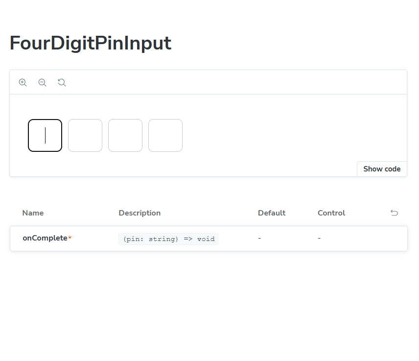
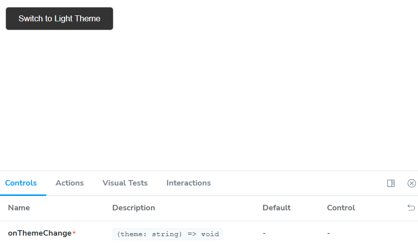

##  React Storybook Components

###  1. Navbar Component
This screenshot shows the responsive navigation bar with theme switcher and active route highlighting.

###  2. OTP Verification Component
This component allows users to enter a 4-digit OTP code with auto-focus and error handling.

###  3. PIN Input Component
A custom-designed 4-digit PIN input with individual boxes and smooth keyboard navigation.

 ### 4. Theme Switcher Component
Users can toggle between light and dark themes. This works globally across the app.

###  5. Button Component
Reusable button component with support for variants (primary, secondary), loading states, and icons.

###  6. Stack Component
A layout utility component to easily stack and space elements vertically or horizontally using props.

